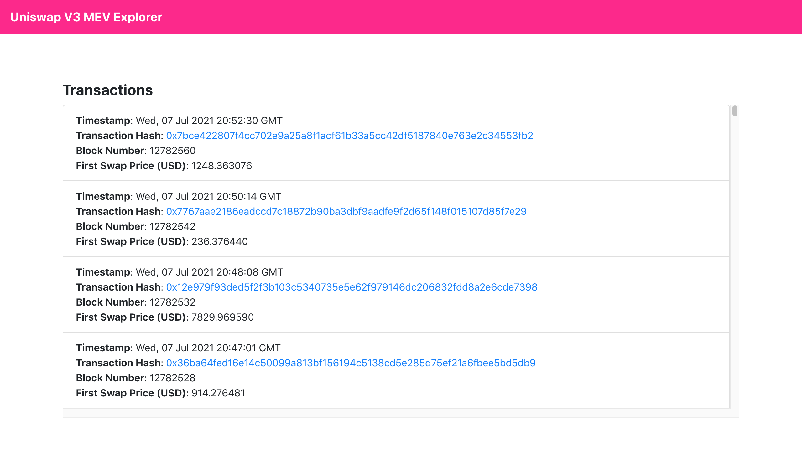

## Uniswap V3 MEV Explorer
Uniswap V3 MEV Explorer allows you to explore Uniswap V3 transactions involving MEV. 
Uniswap V3 MEV Explorer is powered using the Uniswap V3 Subgraph on the Graph Explorer.

### App Link
Uniswap V3 MEV Explorer (Mainnet): https://uniswap-v3-mev-explorer.netlify.app

### Screenshots


### Getting Started

1) Clone the repo

   ```
   git clone https://github.com/viraja1/uniswap-v3-mev-explorer.git 
   ```

2) Change Directory

   ```
   cd uniswap-v3-mev-explorer
   ```
   
3) Install packages

   ```
   npm install
   ```
      
4) Start the app   

   ```
   npm start 
   ```
   
5) Test the app

   http://localhost:3000/ 
